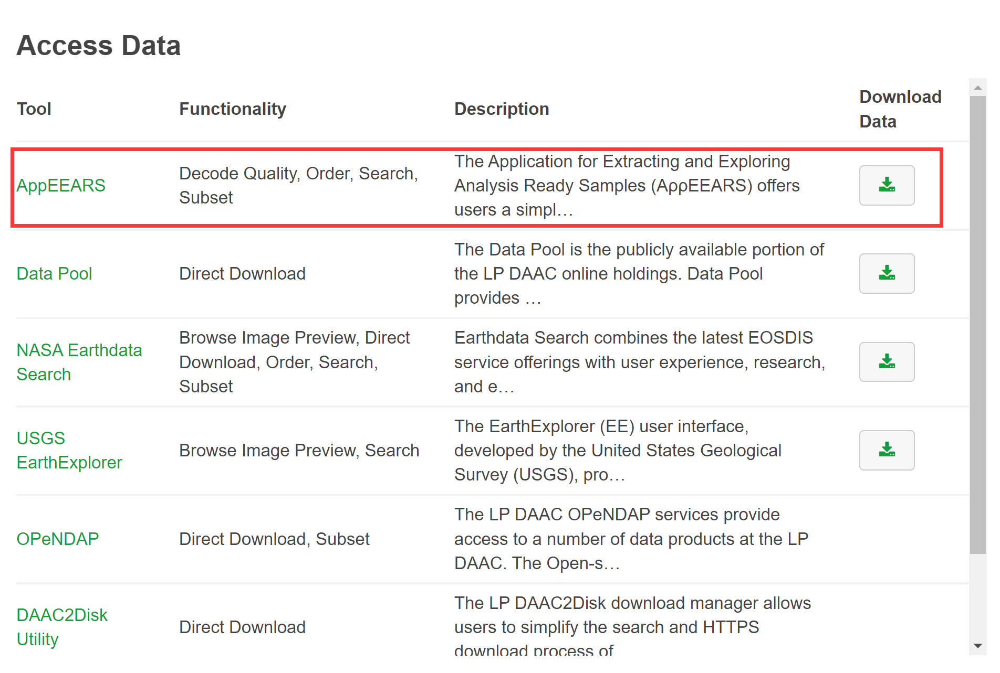
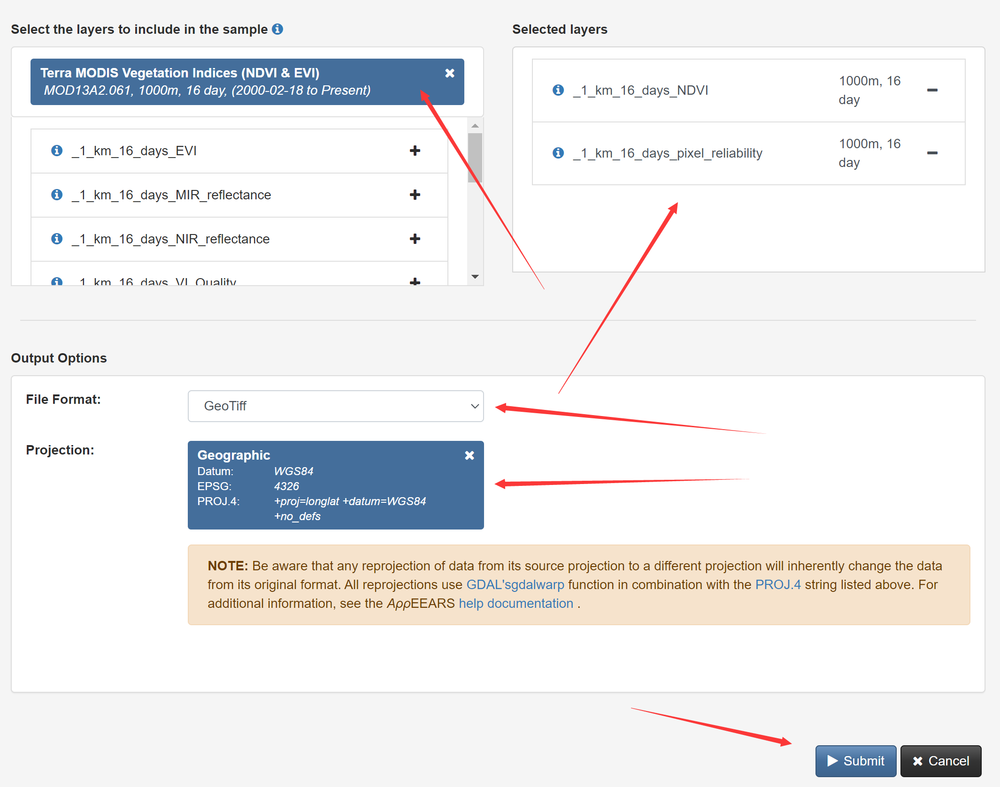
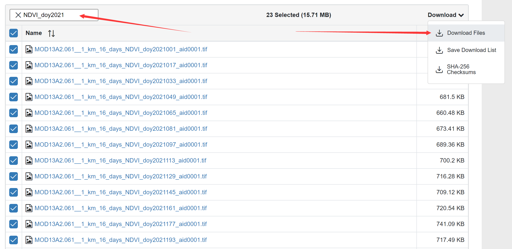

## MODIS NDVI 标准产品

`NDVI`是`MODIS`的标准产品之一，包括16天合成和月合成两种时间分辨率、250米/500米/1公里/0.05度四种空间分辨率，网址：<https://modis.gsfc.nasa.gov/data/dataprod/mod13.php>，其中`MOD13`来自上午星`TERRA`，`MYD13`来自下午星`AQUA`。

我们使用16天合成的1公里分辨率的 `MOD13A2 v061` 版产品为例进行实验，其详细介绍在：<https://lpdaac.usgs.gov/products/mod13a2v061/>.

数据获取途径有很多，我们使用[AppEEARS](https://lpdaacsvc.cr.usgs.gov/appeears/)

## AppEEARS 数据下载流程

首先登录账户，点击菜单栏中的`Extract` → `Area`，然后选择`Start a new request`。

选择一个感兴趣区域，可以利用交互式地图选取，这里我们用方框选取从北方草原到南方森林的一个长条地区作为实验区，选择这里纯粹是个人爱好，你也可以选取其他任何区域，但是要注意实验区的面积越大，你处理的数据量也就越大。给自己选定的区域一个名称，这里我们输入`modis_course`。

指定影像数据的开始时间和结束时间，这里我们选择2011年到2021年。
在`Select the layers to include in the Sample`对话框中，输入`MOD13A2`，找到`Terra MODIS Vegetation Indices (NDVI & EVI) MOD13A2.061`并选择。在图层中选择`NDVI`和`pixel_reliability`。

`pixel_reliability`为数据质量概要信息，可以用来过滤掉质量差的数据点（去噪），下图为MOD13用户手册中的介绍：

然后就可以点击提交了，之后从菜单栏的`Explore`里，可以看到你数据申请的处理状态，等到完成后(Done)，就可以下载了，我们需要NDVI和pixel_reliability两个数据。

如果下载过程因网络不稳定而中断了，可以利用搜索栏，选择未完成的文件继续下载。

