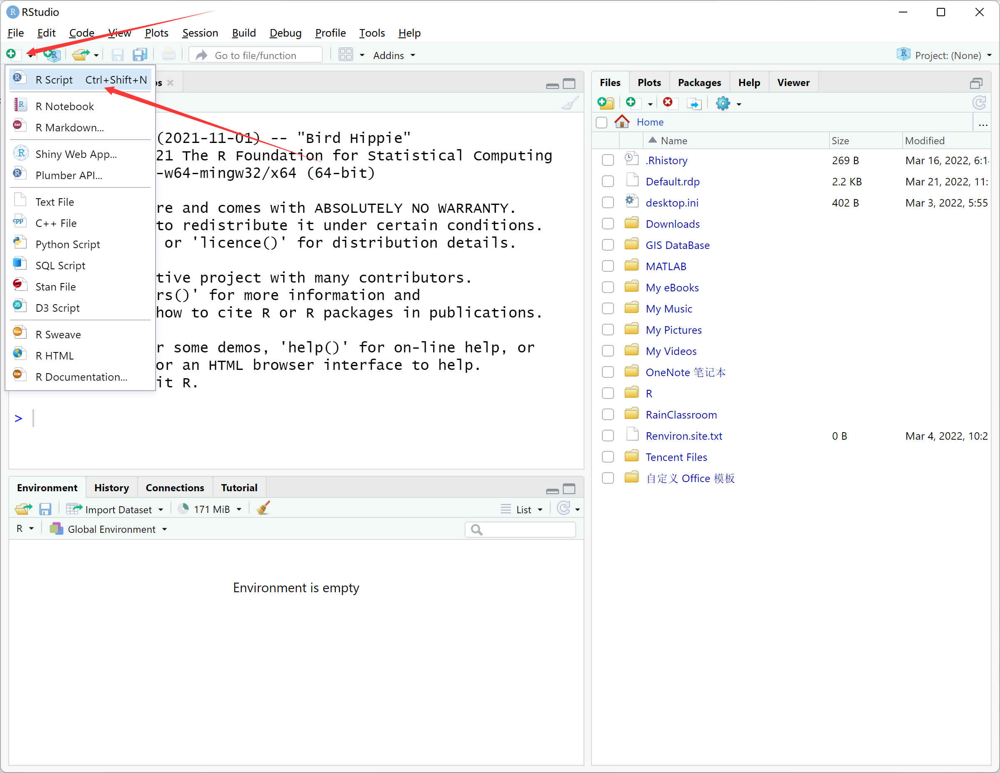
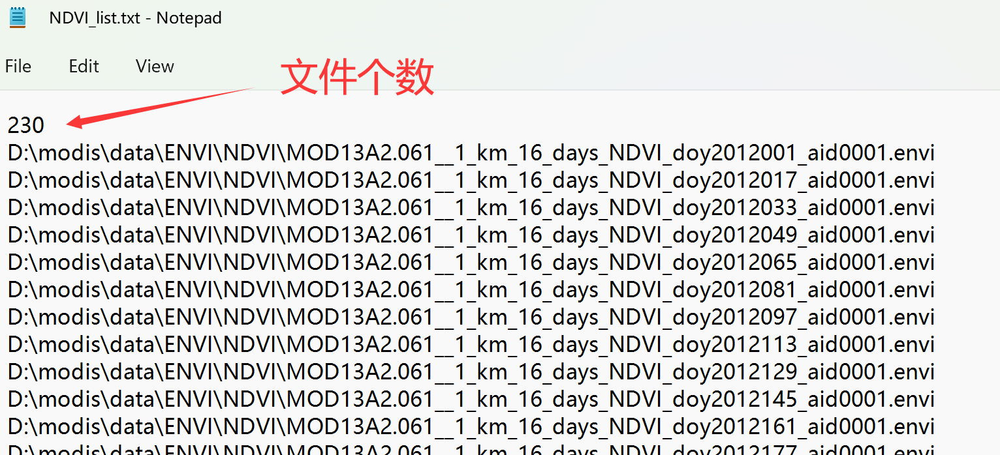

[TIMESAT软件](https://web.nateko.lu.se/timesat/timesat.asp)是由瑞典隆德大学的[Lars Eklundh](https://web.nateko.lu.se/Personal/Lars.Eklundh/)及瑞典马尔默大学的
[Per Jönsson](https://mau.se/en/persons/per.jonsson/)在大约20年前开发的遥感物候分析工具，被全球遥感界广泛使用。TIMESAT使用[FORTRAN语言](https://baike.baidu.com/item/FORTRAN%E8%AF%AD%E8%A8%80/295590)编写，该语言面向科学计算，相较于其他编程语言，其运算效率号称是最快的。

下面我们将使用R编程，按照TIMESAT对输入数据的格式要求，对下载MODIS数据进行预处理。

## 文件组织

创建一个文件夹进行实验操作，其格式如下：

<center>


</center>

将MODIS NDVI的tif文件拷贝到`..\data\GeoTIFF\NDVI`中，质量标识文件 pixel reliability的tif文件拷贝到`..\data\GeoTIFF\QA`中。注意这两组数据应一一对应，以我们这个实验为例，NDVI和pixel reliability分别有253个文件，从2011年到2021年，每年23个16天合成的数据。

## 影像数据格式转换

将下载的GeoTIFF数据转成二进制ENVI格式才能输入到TIMESAT中。ENVI软件的数据格式既是二进制+头文件(`*.hdr`，对二进制文件的解释)。

这里，我们用R代码进行格式转换。首先，打开`RStudio`，新建R Script文件：

<center>



</center>

将以下代码粘贴到新建的R Script文件中，并保存在`Rcode`文件夹下。注意根据你的实际情况修改文件路径。


```
#加载需要用的软件包
if (!require("tidyverse")) install.packages("tidyverse"); library(tidyverse)
if (!require("terra")) install.packages("terra"); library(terra)

# 获取tif数据文件的路径列表
tif_files <- list.files(path = "D:/modis/data/GeoTIFF", 
                        pattern = ".tif",
                        full.names = TRUE,
                        recursive = TRUE)

# 准备envi输出文件的路径列表
envi_files <- tif_files %>% str_replace(".tif", ".envi") %>% 
  str_replace("GeoTIFF", "ENVI")

# 读取tif文件为栅格数据
data <- rast(tif_files)

# 生成envi格式的文件
writeRaster(data, filename = envi_files)

# 准备envi格式数据列表的list文件，用于TIMESAT读取
num <- length(envi_files) / 2 # 影像时间序列个数

# 将文件分隔符从“/” 转成 “\”
envi_files_b <- str_replace_all(envi_files, "/", "\\\\") 

# 分别取出 NDVI 和 QA 文件路径列表
ndvi_envi_files_b <- str_subset(envi_files_b, "NDVI")
qa_envi_files_b <- str_subset(envi_files_b, "pixel_reliability")

#按照TIMESAT要求的格式组织NDVI list文件，并输出txt文件
append(as.character(num), ndvi_envi_files_b) %>% 
  as.data.frame() %>% 
  write.table(file = "D:/modis/data/NDVI_list.txt",
            sep = "\n", quote = FALSE, 
            row.names = FALSE, col.names = FALSE)

#按照TIMESAT要求的格式组织QA list文件，并输出txt文件
append(as.character(num), qa_envi_files_b) %>% 
  as.data.frame() %>% 
  write.table(file = "D:/modis/data/QA_list.txt",
              sep = "\n", quote = FALSE, 
              row.names = FALSE, col.names = FALSE)

```

## 转换后的文件

转换完成后，`data/ENVI`文件夹中应该看到envi格式的NDVI和QA数据，如下图所示：

<center>


</center>

其中`.hdr`为头文件，包含了envi二进制数据的信息，可以用文本编辑器打开查看，如行列数、数据类型、投影等：

<center>


</center>

`data`文件夹中会生成两个txt文件，分别为NDVI和pixel_reliability文件的路径列表(list)，会作为TIMESAT软件的输入文件使用。txt文件的第一行为输入数据的总个数，这里是230 个 = 23个/年 * 10年：

<center>



</center>

至此，数据准备完成，可以打开matlab运行TIMESAT软件了。
