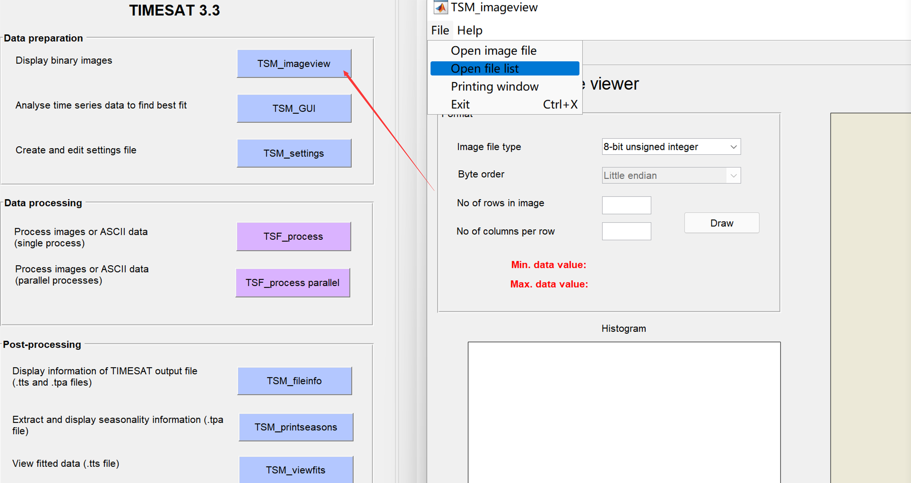
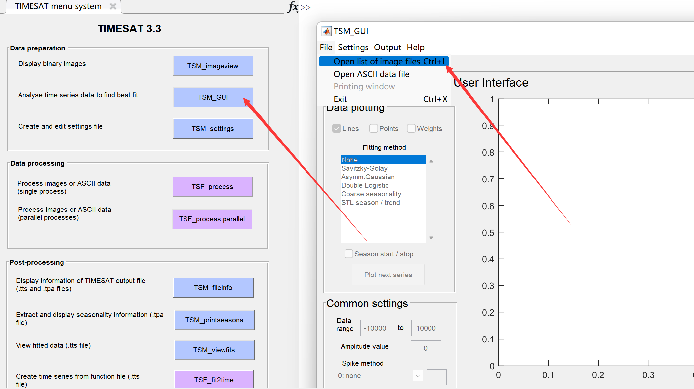

## 查看影像数据

点击`TSM_imageview`，打开之后选择`File → open file list`：

选择之前在R中生成的list文件`..data/NDVI_list.txt`，在TSM_imageview窗口中输入影像的数据类型、行列数，这些信息可以打开任一个ENVI的头文件.hdr获取，填好以后，点击`Draw`，就可以看到实验区NDVI的空间分布了，在列表中选择任一个时间的文件，点击`Draw`之后就会更新：

## 查看时间序列数据

点击`TSM_GUI`，打开之后选择`File → Open list image files`：

选择之前在R中生成的NDVI和QA的list文件，配置如下所示：

其中，QA用来根据不同数据质量赋予NDVI观测点权重，这里我们把天空晴朗的无云观测(QA值为0)赋予权重为1；把数据质量一般的观测(QA值为1)赋予权重为0.5，有云和雪覆盖的观测(QA值为2-3)赋予权重为0。

点击`Show image`可以选择显示时间序列的窗口范围：`Rows to process`和`Columns to process`:

选择完成之后，点击`Load data`就可以看到时间序列啦：

这里是查看时间序列、选定拟合函数、以及设置各种物候提取参数的界面，尝试点击调整不同的设置，探索最佳的或可以接受的参数设置，然后选择`Settings → Save to settings file` 来设置`settings`文件：

检查一下设置，然后就可以保存设置文件到`/run`文件夹了。这里可以为每一种植被类型(`Land cover`)设置不同的参数，我们暂且用同一种参数实验。准备好`settings`文件后，就可以运行处理了。