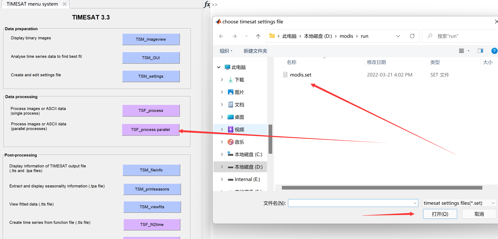
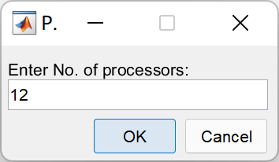
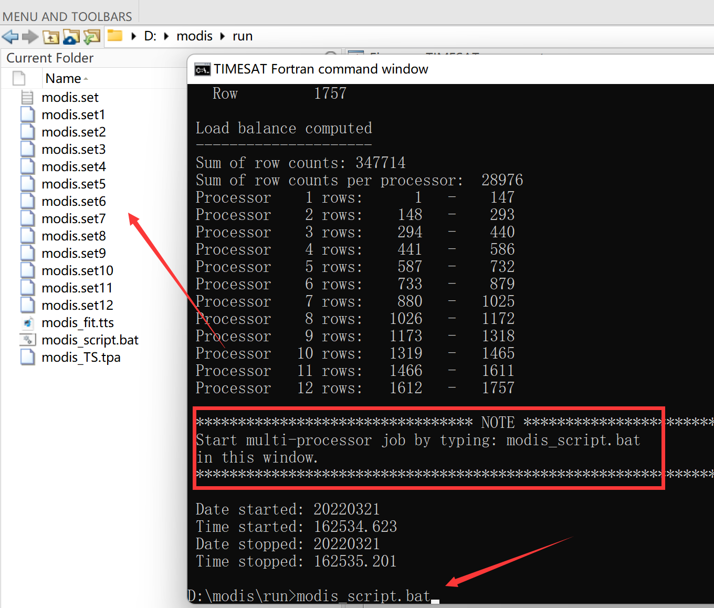
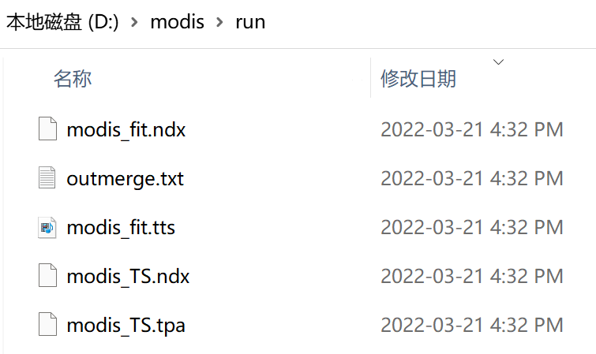

## 单核处理

点击`TSF_process`，选择配置文件`modis.set`：

桌面会弹出`cmd`窗口，`TIMESAT`开始逐行处理影像时间序列：

## 并行处理

如果数据处理量较大，`TIMESAT`还提供了并行处理。可以按`Ctrl + c`停止，然后点击`TSF_process parallel`，键入想要使用的处理器个数(最好不要把所有的`CUP`都占用，容易死机)：

然后，会弹出`cmd`窗口，同时`TIMESAT`会将生成相应个数的`settings`文件，以及`.bat`批处理文件。在`cmd`窗口中键入 `.bat`文件名，`TIMESAT`就开始进行并行处理了：

处理完成后，`/run`文件夹中会生成`.tts`、`.tpa`、`.ndx`文件，这是TIMESAT的中间文件，可以用来查看处理结果，经过后处理即可生成ENVI二进制格式的物候参数了。

