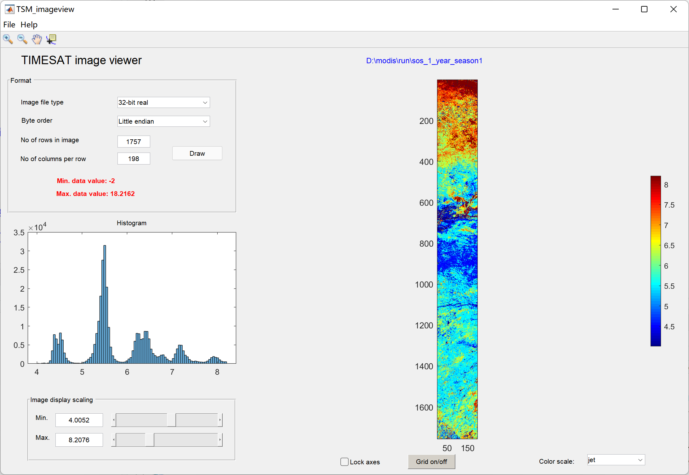

## 生成拟合时间序列影像

曲线拟合可以将原始数据中存在云污染等的观测值进行填补，生成时空连续的影像序列，TIMESAT输出拟合之后的时空连续影像操作如下：点击`TSF_fit2img`：

<center>


</center>

按照提示在cmd窗口中键入参数，生成结果：

<center>


</center>

利用如下R代码生成list文件txt方便使用TIMESAT的`TSM_imageview`查看拟合后的影像(记得根据自己实际情况更改文件路径)：

```
# 生成TIMESAT读list需要的txt文件

#加载需要用的软件包
library(stringr) #用于字符串处理，例如重命名操作

# 获取影像数据文件的路径列表
files <- list.files(path = "D:/modis/run", 
                    pattern = "modis_fited_image_",
                    full.names = TRUE)

# 准备数据列表的list文件，用于TIMESAT读取
num <- length(files)  # 影像时间序列个数
files_b <- str_replace_all(files, "/", "\\\\") # 将文件分隔符从“/” 转成 “\”

#按照TIMESAT要求的格式组织NDVI list文件，并输出txt文件
append(as.character(num), files_b) %>% 
  as.data.frame() %>% 
  write.table(file = "D:/modis/run/modis_fited_image_list.txt",
              sep = "\n", quote = FALSE, 
              row.names = FALSE, col.names = FALSE)
              
```

<center>


</center>


## 生成物候参数影像

点击`TSF_seas2img`生成物候参数影像：

<center>


</center>

按照提示输入参数：

<center>


</center>

使用`TSM_imageview`查看物候参数：


<center>



</center>
